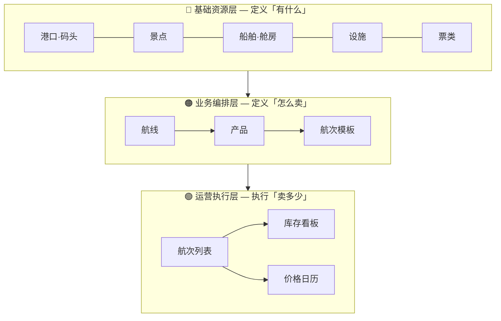
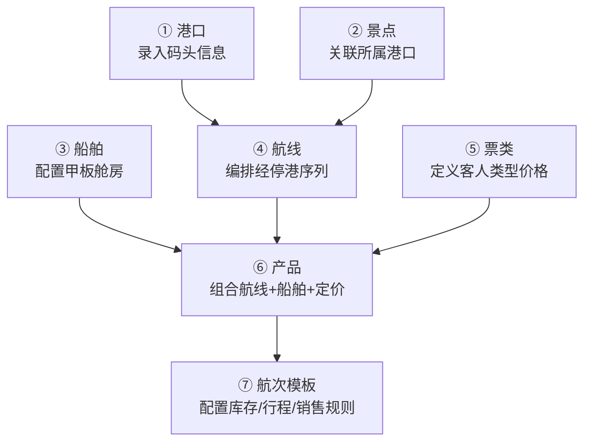
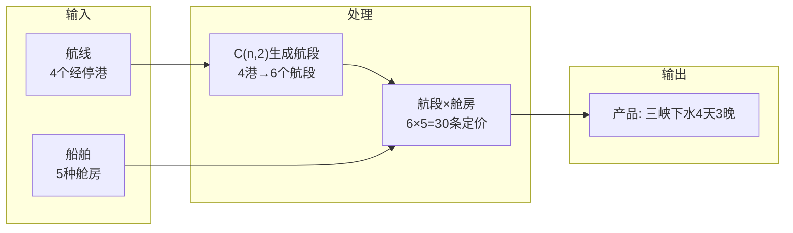
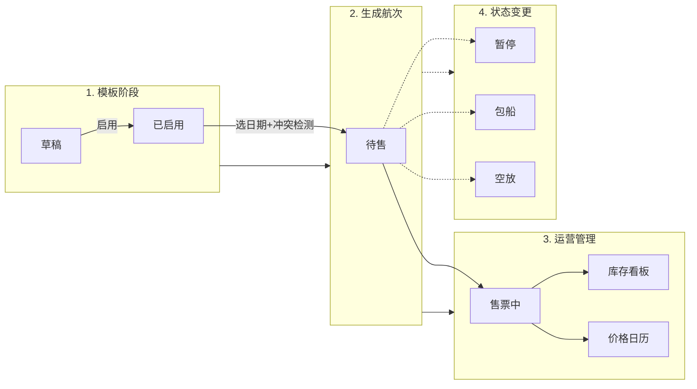
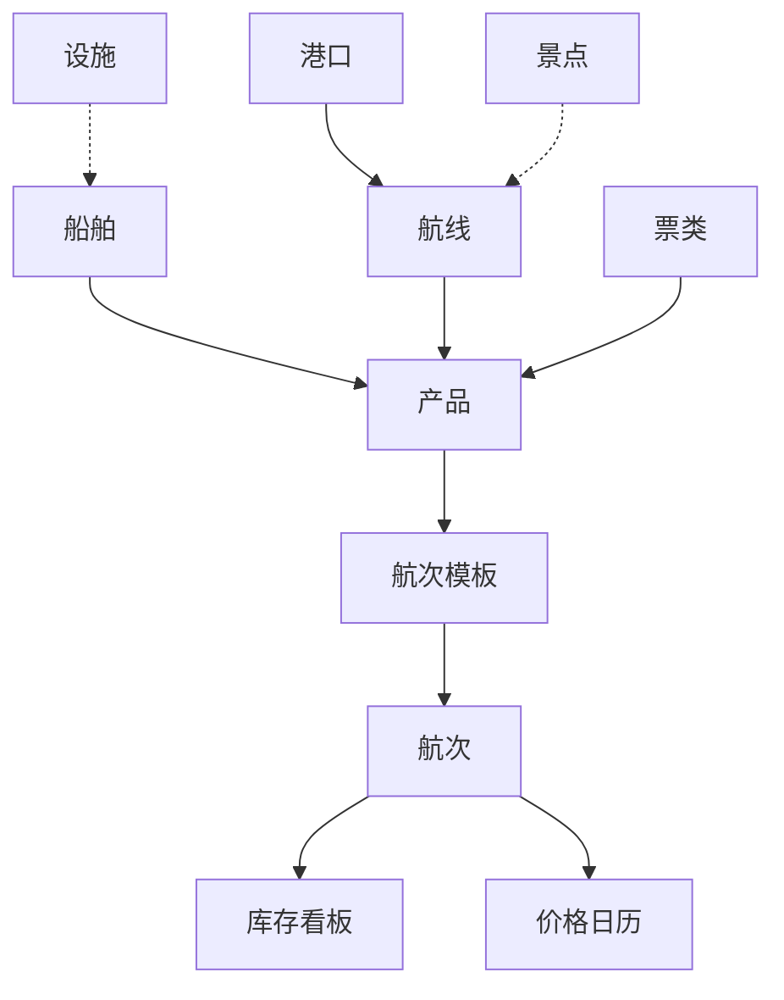
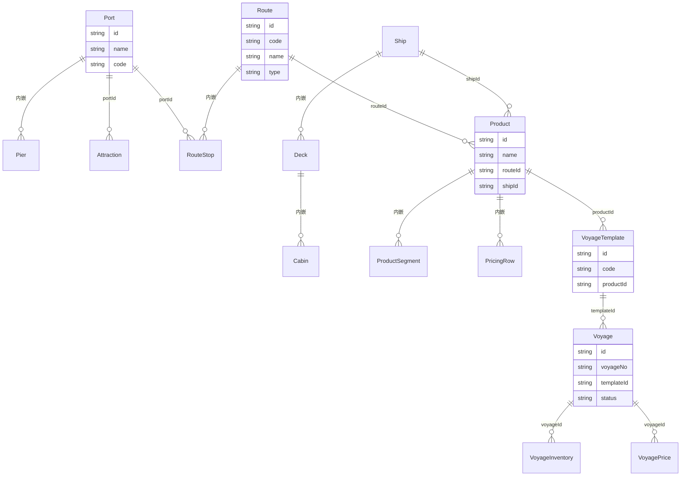

# 长航集团游轮管理系统 — 业务流程图

## 一、系统三层架构

## 二、资源准备 → 产品上线（7 步操作流）

## 三、产品构建核心逻辑

## 四、航次运营全生命周期

## 五、模块依赖关系

## 六、数据全景

## 七、一句话总结

> **港口 + 船舶 → 航线 → 产品 → 模板 → 航次 → 库存/价格**
>
> 每一层都是上一层的组合与实例化，层层递进。
