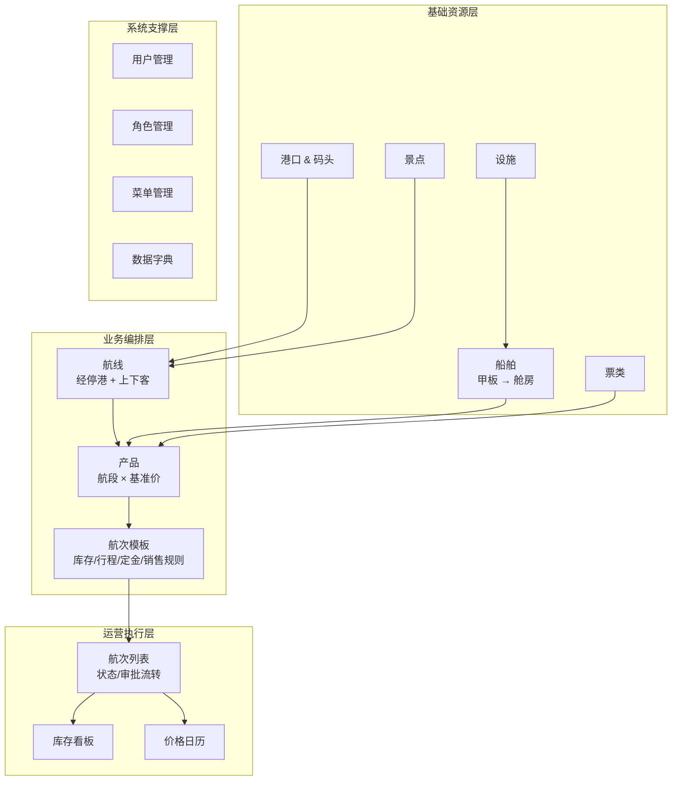
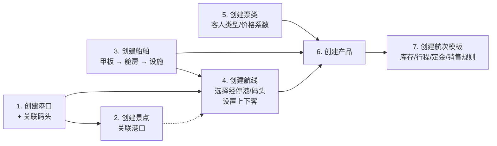
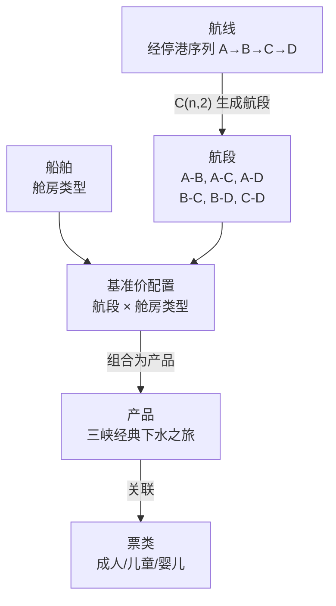
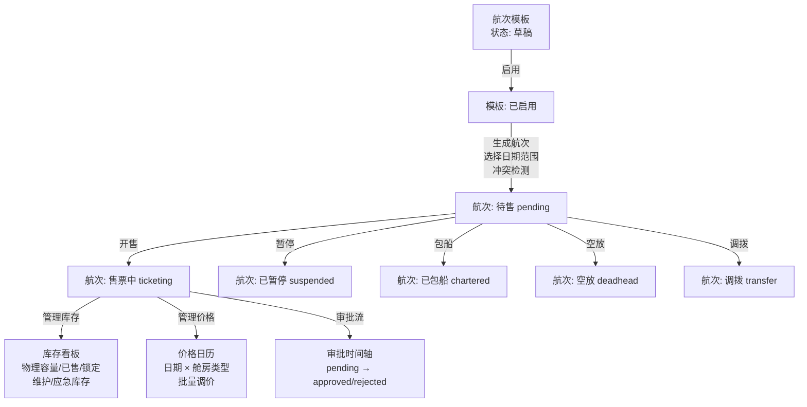
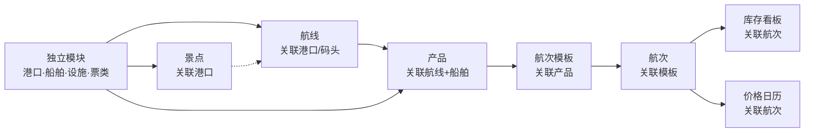

# 长航集团游轮管理系统 — 业务流程与架构图

## 一、系统总览

## 二、基础资源准备流程

## 三、产品构建流程（核心）

## 四、航次全生命周期

## 五、模块依赖链（开发顺序）

## 六、核心实体关系

| 实体 | 关键外键 | 说明 |
|------|----------|------|
| Port | — | 港口，内嵌 Pier[]（码头含位置） |
| Attraction | portId | 景点归属港口 |
| Route | stops[].portId, stops[].pierId | 航线经停港序列 |
| Ship | — | 船舶，内嵌 Deck[] → Cabin[] |
| Product | routeId, shipId | 产品 = 航线 + 船舶 + 航段 + 基准价 |
| VoyageTemplate | productId | 模板含库存/行程/定金/退款规则 |
| Voyage | templateId, productId, shipId, routeId | 航次 = 模板实例化 |
| VoyageInventory | voyageId | 按舱房类型的库存快照 |
| VoyagePrice | voyageId | 按日期 × 舱房类型的价格矩阵 |
