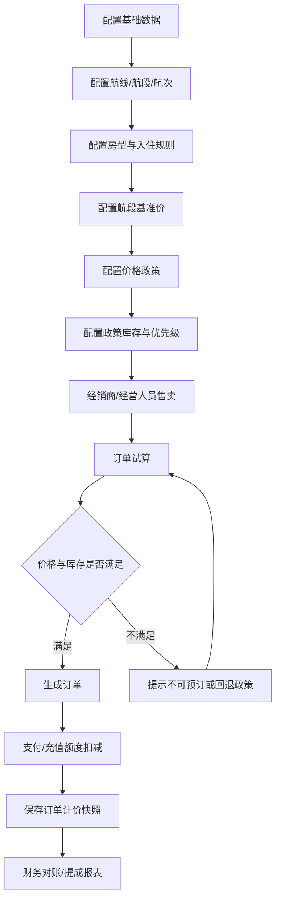
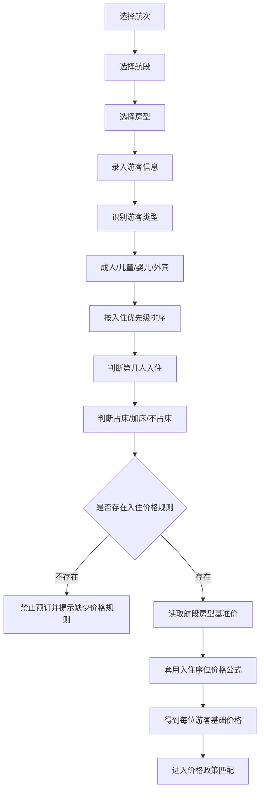
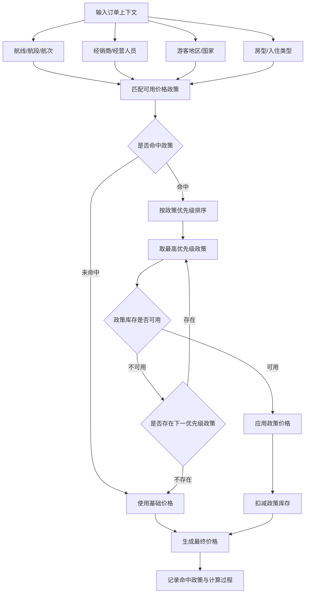
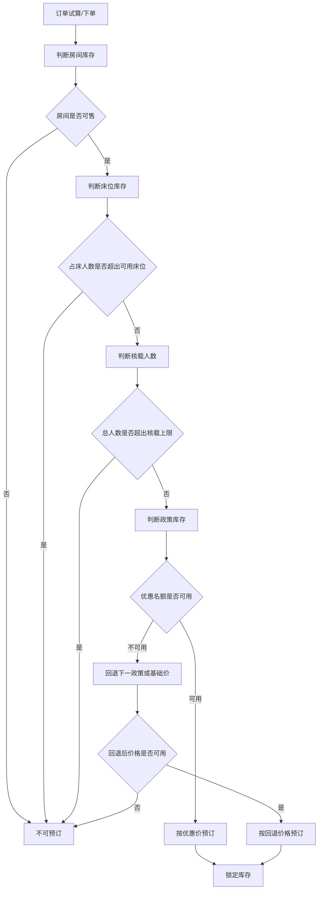
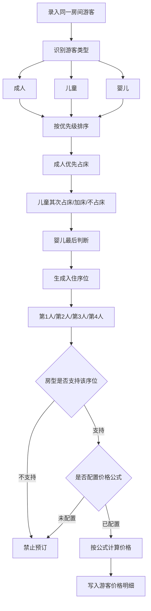
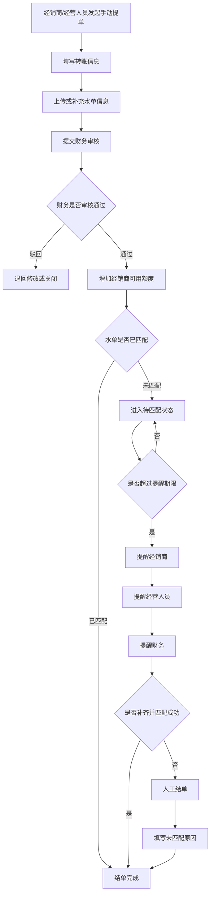
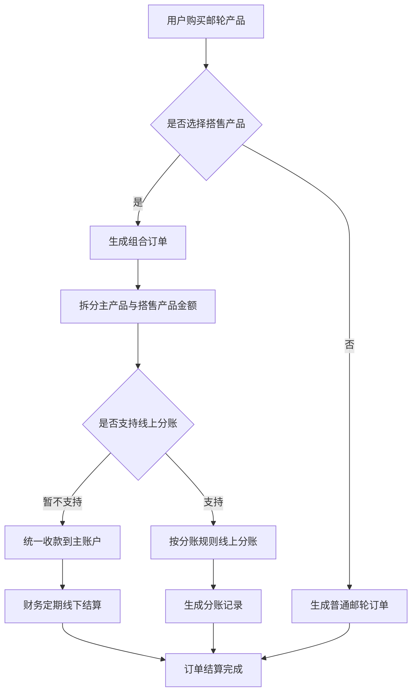
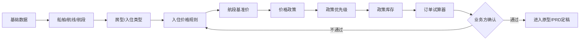
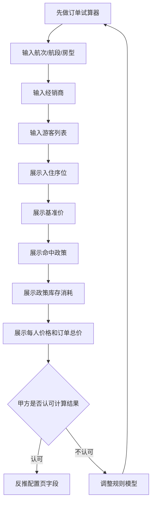

# 邮轮价格与库存流程图

> 基于：`邮轮价格与库存需求访谈-meeting-notes.md`、`邮轮价格与库存需求访谈-产品设计思路.md`
> 用途：辅助原型设计、PRD 编写和研发对齐。

## 1. 整体业务主流程

## 2. 订单价格计算流程

## 3. 价格政策命中与回退流程

## 4. 库存判断流程

## 5. 房型入住计价流程

## 6. 手动充值与水单风控流程

## 7. 组合产品结算流程

## 8. 配置后台页面流转

## 9. 推荐原型验证路径

